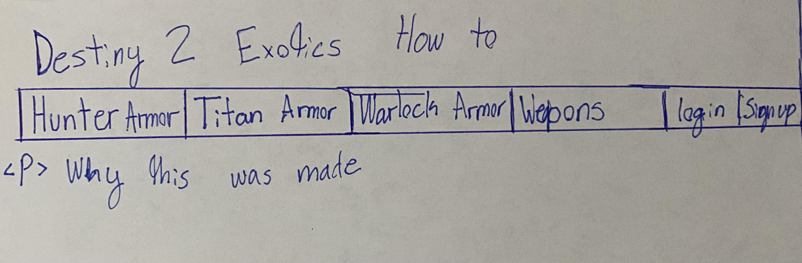
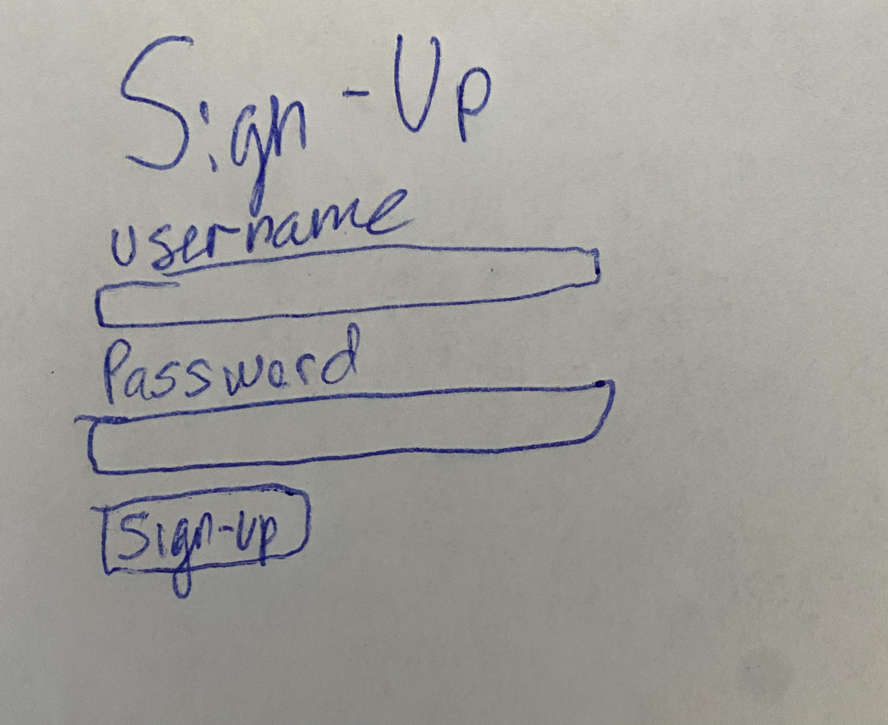
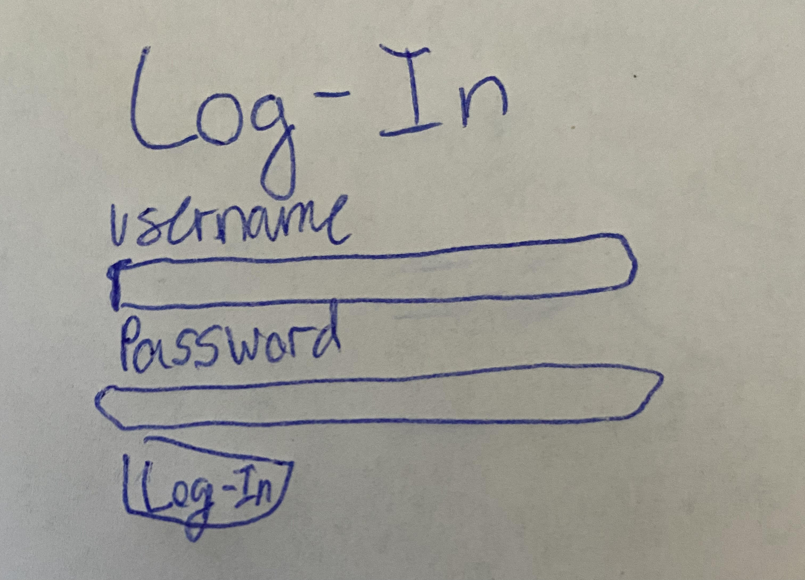
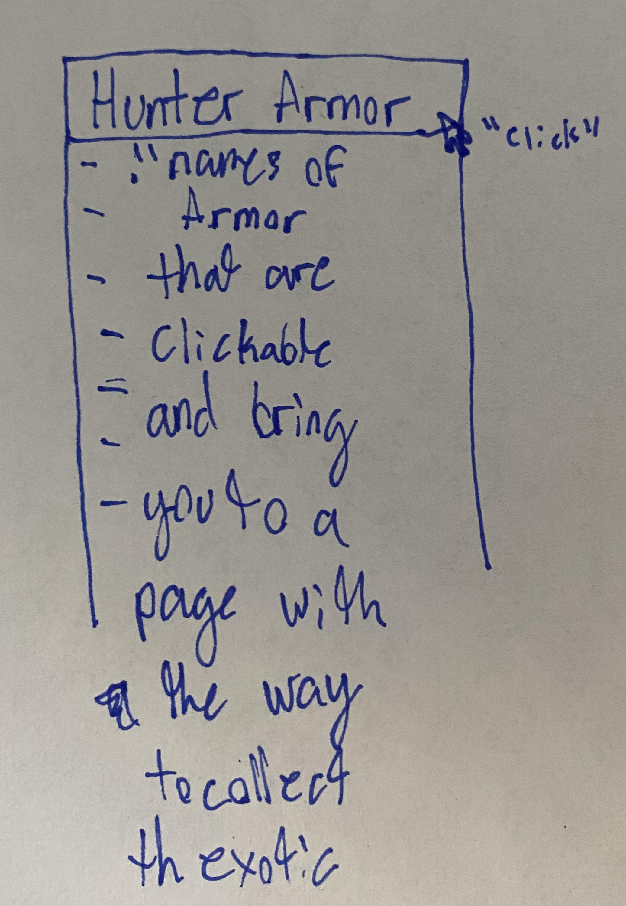
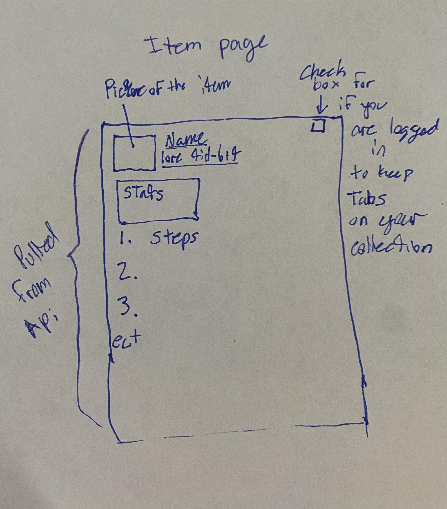
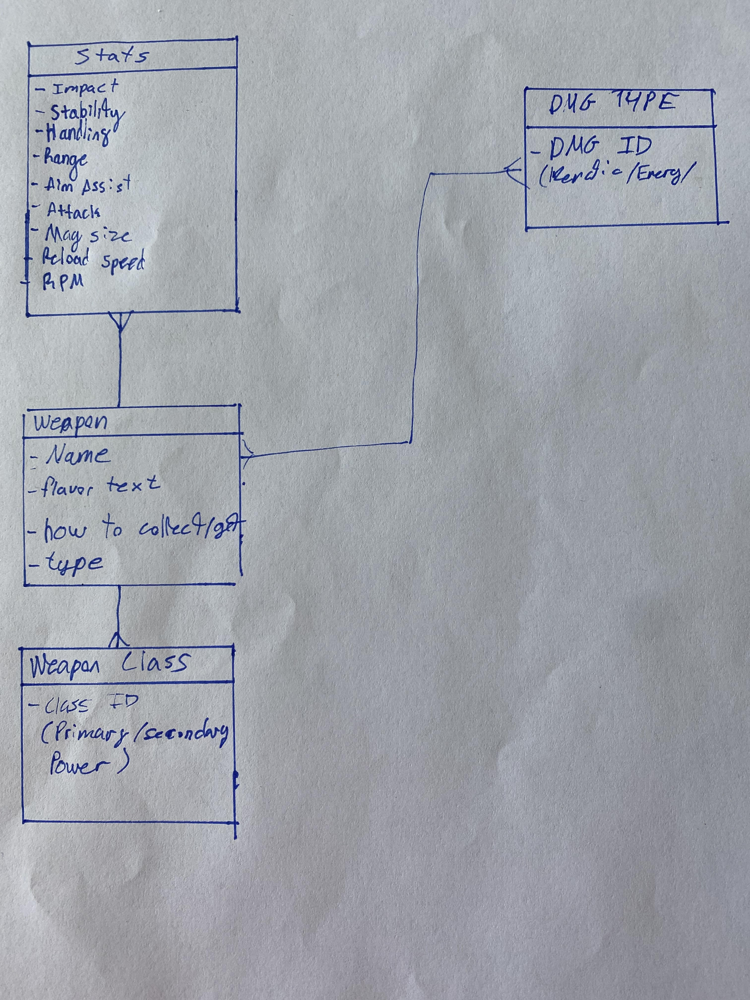

# Project 2 Destiny 2 Exotics How-To

## Description
- This a App used to get information on how to collect every Exotic (Rarity of an item) in the game Destiny 2.
- It will aslo have the stats of the Item.
- aslo the ability to keep track of what Exotics you have collected.

## Installation 
- npm init 
- npm i mongoose express liquid-express-views liquid

## Technoloies used
- CSS Mongoose MongoDb JS Views 
- This uses the Bungie.net api to gather information about the items and the in-game stats.

## User Story
- The user of my app will be able to access info on how to accuire Exotic items in Destiny 2
- The user will also have access to stats and perks of the Item as well.

## Approach taken
- Start off with your downloads, then mov into adding server.js
- add folders for views, models, controllers, public, and utils.
- 

### MVP 
- create a completely useable app that is able to access information about Exotic items

### Stretch plan 
- able to keep a tally of what Exotics you've collected
- add images from the api to the Items Page to make it a nicer looking page.

